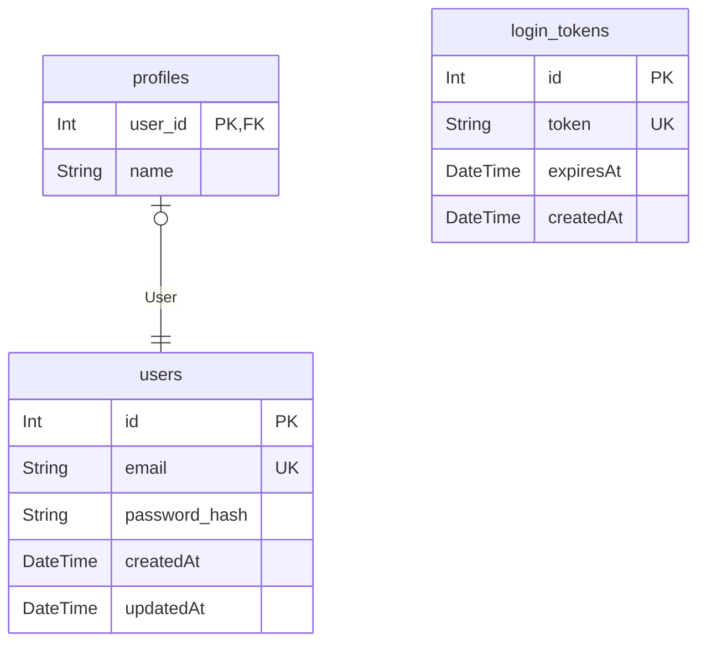

# ER図

> Generated by [`prisma-markdown`](https://github.com/samchon/prisma-markdown)

- [default](#default)

## default

### `users`

Properties as follows:

- `id`:
- `email`:
- `password_hash`:
- `createdAt`:
- `updatedAt`:

### `profiles`

Properties as follows:

- `user_id`:
- `name`:

### `login_tokens`

Properties as follows:

- `id`:
- `token`:
- `expiresAt`:
- `createdAt`:
